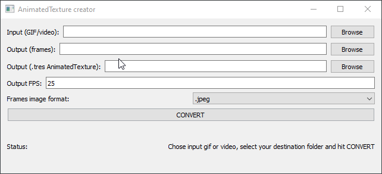

# AnimatedTexture creator

## How to use

### Command line

Type `python convert_to_tres.py` with the right arguements to launch in command line mode.

Arguments:

- `--input`: your input video or gif
- `--output_frames_path`: your output folder for the extracted frames
- `--output_texture_path`: your output file for the AnimatedTexture
- `--fps`: output desired FPS
- `--image_format`: image format of the extracted frames

Type `python convert_to_tres.py --help` for more informations:

    python convert_to_tres.py --help
    usage: convert_to_tres.py [-h] --input INPUT --output_frames_path
                          OUTPUT_FRAMES_PATH --output_texture_path
                          OUTPUT_TEXTURE_PATH [--fps FPS]
                          [--image_format {.jpeg,.jpg,.png,.bmp}]

    Convert GIF or videos into frames and then create AnimatedTexture .tres

    optional arguments:
        -h, --help            show this help message and exit
        --input INPUT         path to input (video/gif)
        --output_frames_path OUTPUT_FRAMES_PATH
                                path where the frames will be saved
        --output_texture_path OUTPUT_TEXTURE_PATH
                                name and path of the AnimatedTexture file generated
        --fps FPS             fps target of the AnimatedTexture
        --image_format {.jpeg,.jpg,.png,.bmp}
                                frames image format ['.jpeg', '.png', '.bmp']

### GUI

Type `python convert_to_tres_GUI.py` to launch in GUI mode

## Tests

### MKV H.265

    python convert_to_tres.py --input="C:\Users\Victor\Documents\dev\godot_video_to_animated_texture\tests\medias\big_buck_bunny_short_h265.mkv" --output_frames_path="C:\Users\Victor\Documents\dev\godot_video_to_animated_texture\tests\frames" --output_texture_path="C:\Users\Victor\Documents\dev\godot_video_to_animated_texture\tests\test_mkv_h265.tres" --fps=25 --image_format=".jpeg"

### MOV

    python convert_to_tres.py --input="C:\Users\Victor\Documents\dev\godot_video_to_animated_texture\tests\medias\big_buck_bunny_short.mov" --output_frames_path="C:\Users\Victor\Documents\dev\godot_video_to_animated_texture\tests\frames" --output_texture_path="C:\Users\Victor\Documents\dev\godot_video_to_animated_texture\tests\test_mov.tres" --fps=25 --image_format=".jpeg"

### MP4

    python convert_to_tres.py --input="C:\Users\Victor\Documents\dev\godot_video_to_animated_texture\tests\medias\big_buck_bunny_short.mp4" --output_frames_path="C:\Users\Victor\Documents\dev\godot_video_to_animated_texture\tests\frames" --output_texture_path="C:\Users\Victor\Documents\dev\godot_video_to_animated_texture\tests\test_mp4.tres" --fps=25 --image_format=".jpeg"

### MKV MPEG-4 

    python convert_to_tres.py --input="C:\Users\Victor\Documents\dev\godot_video_to_animated_texture\tests\medias\big_buck_bunny_short_MPEG-4.mkv" --output_frames_path="C:\Users\Victor\Documents\dev\godot_video_to_animated_texture\tests\frames" --output_texture_path="C:\Users\Victor\Documents\dev\godot_video_to_animated_texture\tests\test_mkv_mpeg4.tres" --fps=25 --image_format=".jpeg"

## TODO:

- [X] Disable buttons during processing
- [X] Show progress
- [X] Update log label based on what's happening
- [X] Handle errors
- [X] Handle file selection (write selected folder/file to textedit, and use this value for the next steps)
    - [X] Input
    - [X] Output frames
    - [X] Output texture
- [X] Handle input text 
- [X] Basic layout
- [X] Requires components
- [X] Connect buttons to callback methods